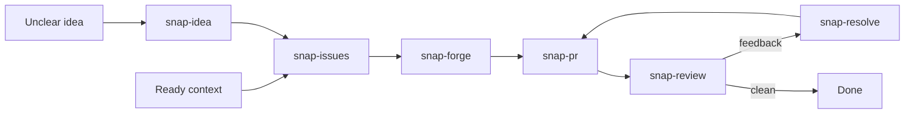

# SNAP

> **SNAP's Not A Prompt**

Portable, opinionated [Agent Skills](https://agentskills.io) for shaping work, implementing it, publishing it, and closing the review loop.

## Flow



`snap-visual` can explain work at any stage. `snap-handoff` can transfer any stage to a fresh agent.

## Skills

| Stage | Skill | Use it when |
| --- | --- | --- |
| Shape | `snap-idea` | Consequential ambiguity or tradeoffs must be resolved before work starts. |
| Shape | `snap-issues` | Context must become one concise issue or an approved set of vertical issues. |
| Build | `snap-forge` | Substantial work should be implemented with meaningful tests and atomic commits. |
| Publish | `snap-pr` | Relevant changes must be staged, committed, pushed, and published as a reviewer-ready PR. |
| Review | `snap-review` | A PR needs read-only review for correctness, architecture, test quality, and material risk. |
| Resolve | `snap-resolve` | Review feedback or failing CI must be fixed, answered, and resolved. |
| Explain | `snap-visual` | A concept, plan, architecture, or comparison will land better as a visual brief. |
| Transfer | `snap-handoff` | Continuation-critical session state must move to a fresh agent. |

## Install

All skills:

```bash
npx skills add sadiksaifi/skills
```

One skill:

```bash
npx skills add sadiksaifi/skills --skill snap-forge
```

After installation, ask naturally or invoke a skill by name where the harness supports explicit skill invocation.
