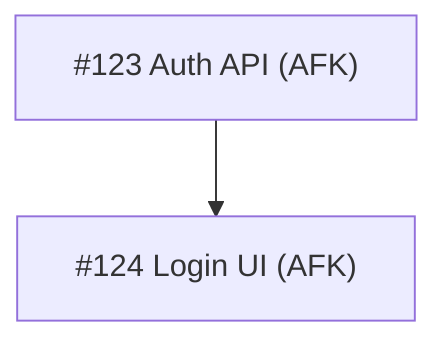

# Breakdown Template

Use the Markdown inside `<template>` as the GitHub issue comment body.

<template>

## Issue Breakdown

| Issue | Type | Blocked by | Covers |
| --- | --- | --- | --- |
| [#123](https://github.com/OWNER/REPO/issues/123) Auth API | AFK | None | US-1, US-2 |
| [#124](https://github.com/OWNER/REPO/issues/124) Login UI | AFK | #123 | US-3 |

</template>
