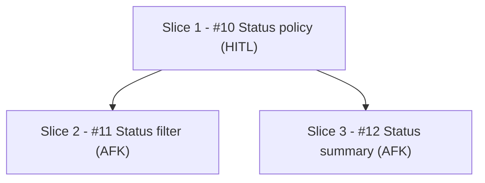

# Breakdown Final Template

Use after issue creation. Keep `Slice N`; add canonical issue links outside Mermaid. Mermaid labels use issue numbers without Markdown links.

<template>

## Slice Breakdown

### Dependency Graph

### Slices

- `Slice:` Slice 1 - [#10](https://github.com/OWNER/REPO/issues/10) Status policy
  `Type:` HITL
  `Size:` S
  `Blocked by:` none
  `Best after:` none
  `Parallel:` yes
- `Slice:` Slice 2 - [#11](https://github.com/OWNER/REPO/issues/11) Status filter
  `Type:` AFK
  `Size:` M
  `Blocked by:` [#10](https://github.com/OWNER/REPO/issues/10)
  `Best after:` none
  `Parallel:` no
- `Slice:` Slice 3 - [#12](https://github.com/OWNER/REPO/issues/12) Status summary
  `Type:` AFK
  `Size:` M
  `Blocked by:` [#10](https://github.com/OWNER/REPO/issues/10)
  `Best after:` [#11](https://github.com/OWNER/REPO/issues/11)
  `Parallel:` no hard blocker after #10

### Coverage

- `FR-1:` Slice 2 - [#11](https://github.com/OWNER/REPO/issues/11) Status filter
- `FR-2:` Slice 2 - [#11](https://github.com/OWNER/REPO/issues/11) Status filter
- `FR-3:` Slice 3 - [#12](https://github.com/OWNER/REPO/issues/12) Status summary
- `NFR-1:` Slice 1 - [#10](https://github.com/OWNER/REPO/issues/10) Status policy; Slice 2 - [#11](https://github.com/OWNER/REPO/issues/11) Status filter; Slice 3 - [#12](https://github.com/OWNER/REPO/issues/12) Status summary

### Validation

- `Blocked By parity:` pass
- `Checked:` issue `Blocked By` refs equal dependency graph incoming edges by issue ref
- `Soft order:` `Best after` excluded from hard blocker parity
- `Coverage:` all FRs and NFRs assigned

</template>
