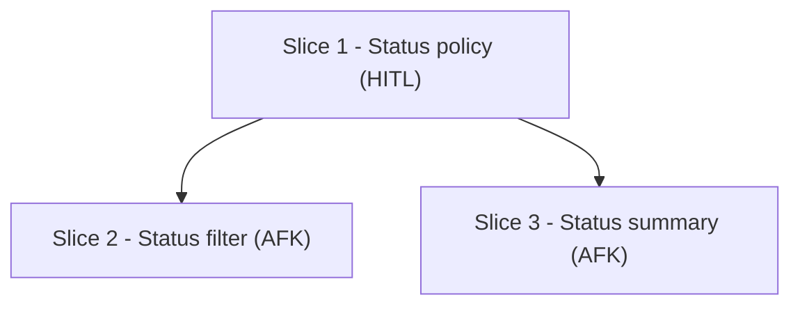

# Breakdown Initial Template

Use before issue creation. `Slice N` staging ids are allowed here and in the dependency graph.

<template>

## Slice Breakdown

### Dependency Graph

### Slices

- `Slice:` Slice 1 - Status policy
  `Type:` HITL
  `Size:` S
  `Blocked by:` none
  `Best after:` none
  `Parallel:` yes
- `Slice:` Slice 2 - Status filter
  `Type:` AFK
  `Size:` M
  `Blocked by:` Slice 1
  `Best after:` none
  `Parallel:` no
- `Slice:` Slice 3 - Status summary
  `Type:` AFK
  `Size:` M
  `Blocked by:` Slice 1
  `Best after:` Slice 2
  `Parallel:` no hard blocker after Slice 1

### Coverage

- `FR-1:` Slice 2
- `FR-2:` Slice 2
- `FR-3:` Slice 3
- `NFR-1:` Slice 1, Slice 2, Slice 3

### Validation

- `Status:` pending issue creation
- `Rule:` final issue `Blocked By` refs must match graph incoming edges by issue ref

</template>
