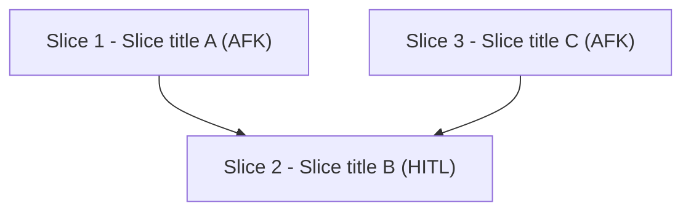
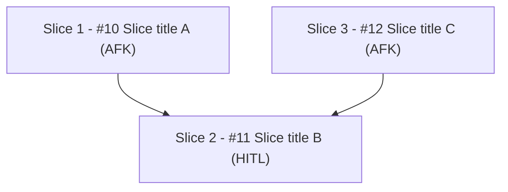

# PRD Comment Template

Two-phase: post with `Slice N` staging ids before issue creation. Edit after issue creation so every durable dependency field uses issue refs. Final slice labels keep stable staging id plus canonical issue link: `Slice N - [#<issue>](<issue-url>) <title>`.

## Initial Template (Step 5)

````markdown
## Slice Breakdown

### Dependency Graph



### Slices

- `Slice:` Slice 1 - Slice title A
  `Type:` AFK
  `Size:` S
  `Blocked by:` none
  `Best after:` none
  `Parallel:` yes
- `Slice:` Slice 2 - Slice title B
  `Type:` HITL
  `Size:` M
  `Blocked by:` Slice 1, Slice 3
  `Best after:` none
  `Parallel:` no
- `Slice:` Slice 3 - Slice title C
  `Type:` AFK
  `Size:` S
  `Blocked by:` none
  `Best after:` Slice 1
  `Parallel:` yes

### Coverage

- `FR-1:` Slice 1 - Slice title A
- `FR-2:` Slice 1 - Slice title A; Slice 2 - Slice title B
- `NFR-1:` Slice 2 - Slice title B

### Validation

- `Blocked By parity:` pending issue creation
- `Coverage:` all FRs and NFRs assigned
````

## Final Form (Step 7)

Replace slice labels with `Slice N - [#<number>](<issue-url>) title` everywhere outside Mermaid. Mermaid labels include `Slice N - #<number> title` because links are not reliable inside graph nodes.

````markdown
## Slice Breakdown

### Dependency Graph



### Slices

- `Slice:` Slice 1 - [#10](https://github.com/OWNER/REPO/issues/10) Slice title A
  `Type:` AFK
  `Size:` S
  `Blocked by:` none
  `Best after:` none
  `Parallel:` yes
- `Slice:` Slice 2 - [#11](https://github.com/OWNER/REPO/issues/11) Slice title B
  `Type:` HITL
  `Size:` M
  `Blocked by:` [#10](https://github.com/OWNER/REPO/issues/10), [#12](https://github.com/OWNER/REPO/issues/12)
  `Best after:` none
  `Parallel:` no
- `Slice:` Slice 3 - [#12](https://github.com/OWNER/REPO/issues/12) Slice title C
  `Type:` AFK
  `Size:` S
  `Blocked by:` none
  `Best after:` [#10](https://github.com/OWNER/REPO/issues/10)
  `Parallel:` yes

### Coverage

- `FR-1:` Slice 1 - [#10](https://github.com/OWNER/REPO/issues/10) Slice title A
- `FR-2:` Slice 1 - [#10](https://github.com/OWNER/REPO/issues/10) Slice title A; Slice 2 - [#11](https://github.com/OWNER/REPO/issues/11) Slice title B
- `NFR-1:` Slice 2 - [#11](https://github.com/OWNER/REPO/issues/11) Slice title B

### Validation

- `Blocked By parity:` pass
- `Checked:` #11 blocked by #10 and #12; graph edges S1->S2 and S3->S2 match issue-local blockers
- `Soft order:` #12 best after #10; excluded from hard blocker parity
- `Coverage:` all FRs and NFRs assigned
````

## Formatting Rules

- **Mermaid `graph TD`** — top-down. Edges = hard blocked-by only; arrow from blocker → blocked.
- **Node labels** — initial `Slice N - title (Type)`; final `Slice N - #<number> title (Type)`.
- **Slice labels** — final `Slice N - [#<number>](<issue-url>) title` outside Mermaid.
- **Slices list** — dependency order; bullets and label lines only; no markdown tables.
- **Blocked by** — initial may use `Slice N`; final must use issue refs or `none`.
- **Best after** — optional soft ordering; issue refs in final; not a graph edge.
- **Coverage** — one line per FR/NFR from parent PRD. Every ID must appear.
- **Validation** — include blocker parity result. Fail/stop before final publish on mismatch.
- **Footer equivalent** — `Coverage: all FRs and NFRs assigned` or flag gaps.
