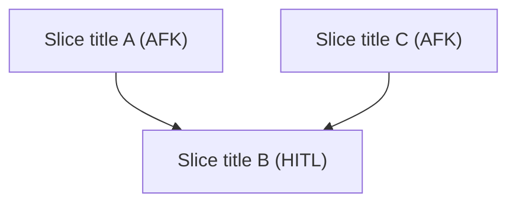
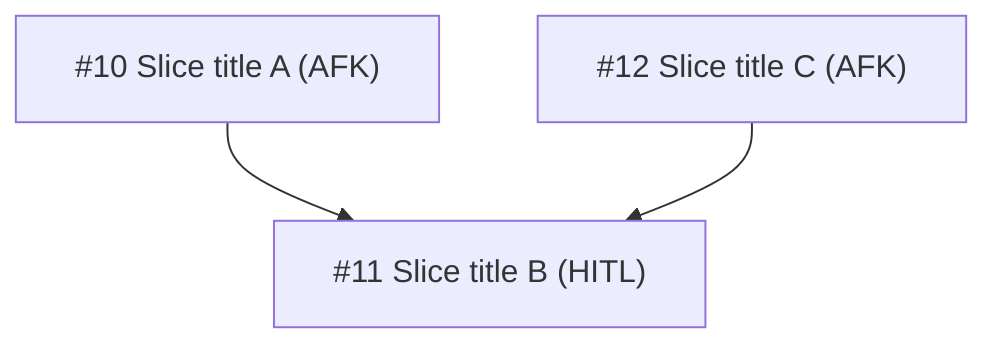

# PRD Comment Template

Two-phase: post with slice titles (Step 5), edit to swap in real issue refs (Step 7) via `gh issue comment <prd-number> --edit-last`.

## Initial Template (Step 5)

````markdown
## Slice Breakdown

### Dependency graph



### Slices

| Slice | Type | Size | Blocked by | Parallel |
|-------|------|------|------------|----------|
| Slice title A | AFK | S | None | Yes |
| Slice title B | HITL | M | Slice title A | No |

### Coverage

| Requirement | Slice(s) |
|-------------|----------|
| FR-1 | Slice title A |
| FR-2 | Slice title A, Slice title B |
| NFR-1 | Slice title B |

All FRs and NFRs assigned.
````

## Final Form (Step 7)

Replace slice titles with `#<number> title` everywhere — mermaid nodes, slice table, coverage table. Example after edit:

````markdown
### Dependency graph



### Slices

| Slice | Type | Size | Blocked by | Parallel |
|-------|------|------|------------|----------|
| #10 Slice title A | AFK | S | None | Yes |
| #11 Slice title B | HITL | M | #10 | No |
````

## Formatting Rules

- **Mermaid `graph TD`** — top-down. Edges = blocked-by (arrow from blocker → blocked)
- **Node labels** — `#<number> title (Type)` in final form; `title (Type)` in initial
- **Slice table** — dependency order. Parallel = Yes if no unresolved blockers
- **Coverage table** — one row per FR/NFR from parent PRD. Every ID must appear
- **Footer** — "All FRs and NFRs assigned." or flag gaps
