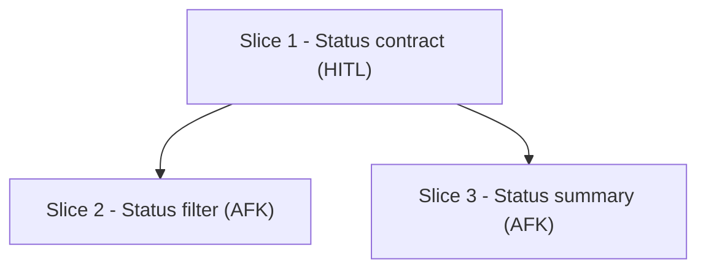
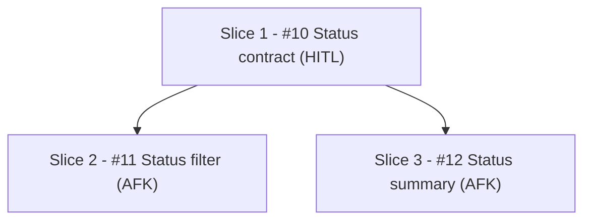

# Slice Templates

## Breakdown Comment — Initial

Use before issue creation. `Slice N` allowed only here and in the dependency graph.

````markdown
## Slice Breakdown

### Dependency Graph



### Slices

- `Slice:` Slice 1 - Status contract
  `Type:` HITL
  `Size:` S
  `Blocked by:` none
  `Best after:` none
  `Parallel:` yes
- `Slice:` Slice 2 - Status filter
  `Type:` AFK
  `Size:` M
  `Blocked by:` Slice 1
  `Best after:` none
  `Parallel:` no
- `Slice:` Slice 3 - Status summary
  `Type:` AFK
  `Size:` M
  `Blocked by:` Slice 1
  `Best after:` Slice 2
  `Parallel:` no hard blocker after Slice 1

### Coverage

- `FR-1:` Slice 2
- `FR-2:` Slice 2
- `FR-3:` Slice 3
- `NFR-1:` Slice 1, Slice 2, Slice 3

### Validation

- `Status:` pending issue creation
- `Rule:` final issue `Blocked By` refs must match graph incoming edges by issue ref
````

## Breakdown Comment — Final

Use after issue creation. Keep `Slice N`; add canonical issue links.

````markdown
## Slice Breakdown

### Dependency Graph



### Slices

- `Slice:` Slice 1 - [#10](https://github.com/OWNER/REPO/issues/10) Status contract
  `Type:` HITL
  `Size:` S
  `Blocked by:` none
  `Best after:` none
  `Parallel:` yes
- `Slice:` Slice 2 - [#11](https://github.com/OWNER/REPO/issues/11) Status filter
  `Type:` AFK
  `Size:` M
  `Blocked by:` [#10](https://github.com/OWNER/REPO/issues/10)
  `Best after:` none
  `Parallel:` no
- `Slice:` Slice 3 - [#12](https://github.com/OWNER/REPO/issues/12) Status summary
  `Type:` AFK
  `Size:` M
  `Blocked by:` [#10](https://github.com/OWNER/REPO/issues/10)
  `Best after:` [#11](https://github.com/OWNER/REPO/issues/11)
  `Parallel:` no hard blocker after #10

### Coverage

- `FR-1:` Slice 2 - [#11](https://github.com/OWNER/REPO/issues/11) Status filter
- `FR-2:` Slice 2 - [#11](https://github.com/OWNER/REPO/issues/11) Status filter
- `FR-3:` Slice 3 - [#12](https://github.com/OWNER/REPO/issues/12) Status summary
- `NFR-1:` Slice 1 - [#10](https://github.com/OWNER/REPO/issues/10) Status contract; Slice 2 - [#11](https://github.com/OWNER/REPO/issues/11) Status filter; Slice 3 - [#12](https://github.com/OWNER/REPO/issues/12) Status summary

### Validation

- `Blocked By parity:` pass
- `Checked:` issue `Blocked By` refs equal dependency graph incoming edges by issue ref
- `Soft order:` `Best after` excluded from hard blocker parity
- `Coverage:` all FRs and NFRs assigned
````

## Slice Issue — Final/Publishable

````markdown
## Parent PRD
- `Issue:` #123
- `Breakdown:` https://github.com/OWNER/REPO/issues/123#issuecomment-...

## Slice Overview
- Thin end-to-end behavior

## Acceptance
- [ ] `AC-1:` [specific behavior]

## Coverage
- `US-1:` [brief]
- `FR-1:` [brief]
- `NFR-1:` [brief]

## Technical Hints
- `path/to/module.ts:` pattern or seam

## Type
- `Type:` AFK

## Blocked By
- `Blocked by:` #124 — [hard prerequisite reason]

## Best After
- `Best after:` #125 — [optional soft sequencing reason]

## Size
- `Size:` S
````

Use bullets and label lines only outside Mermaid. Do not switch to tables.
Use `HITL` only when prompt/repo leaves a real decision open.
If source PRD is closed, recover semantics from repo and fold them into the first AFK slice.
If ambiguity is local to one branch, isolate that blocker and keep unrelated slices parallel.
If `Open Questions` explicitly marks a rule unresolved, do not settle it from current fixtures or tests.
If summary/reporting only shares a classifier seam with filtering, let both branch from that seam.
Do not emit AFK-only seam/setup slices with no user-visible behavior.
Keep `Blocked by:` minimal; independent params stay parallel.
Keep docs/tests with the behavior slice they validate; do not peel them into a chores-only tail slice.
Issue-local `Blocked By` must be `#N`/`[#N](url)` or `none`; never `Slice N`.
`Best after:` is optional soft ordering and never a blocker.
Before final publish/update, validate issue-local blockers against final graph refs and stop on mismatch.
