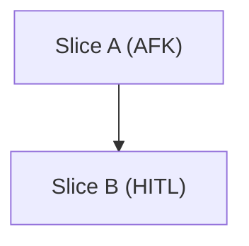

# Slice Templates

## Breakdown Comment

````markdown
## Slice Breakdown

### Dependency Graph


### Slices
- `Slice:` Slice A
  `Type:` AFK
  `Size:` S
  `Blocked by:` none
  `Parallel:` yes
- `Slice:` Slice B
  `Type:` HITL
  `Size:` M
  `Blocked by:` Slice A
  `Parallel:` no
### Coverage
- `FR-1:` Slice A
- `FR-2:` Slice A, Slice B
- `NFR-1:` Slice B
````

## Slice Issue

````markdown
## Parent PRD
- `Issue:` #123
- `Breakdown:` <comment-url>
## Slice Overview
- Thin end-to-end behavior
## Acceptance
- [ ] `AC-1:` [specific behavior]
## Coverage
- `US-1:` [brief]
- `FR-1:` [brief]
- `NFR-1:` [brief]
## Technical Hints
- `path/to/module.ts:` pattern or seam
## Type
- `Type:` AFK
## Blocked By
- `Blocked by:` none
## Size
- `Size:` S
````

Use bullets and label lines only outside the Mermaid graph. Do not switch to tables.
Use `HITL` only when prompt/repo leaves a real decision open.
If source PRD is closed, recover semantics from repo and fold them into the first AFK slice.
If ambiguity is local to one branch, isolate that blocker and keep unrelated slices parallel.
If `Open Questions` explicitly marks a rule unresolved, do not settle it from current fixtures or tests.
If summary/reporting only shares a classifier seam with filtering, let both branch from that seam.
Do not emit AFK-only seam/setup slices with no user-visible behavior.
Keep `Blocked by:` minimal; independent params stay parallel.
Keep docs/tests with the behavior slice they validate; do not peel them into a chores-only tail slice.
