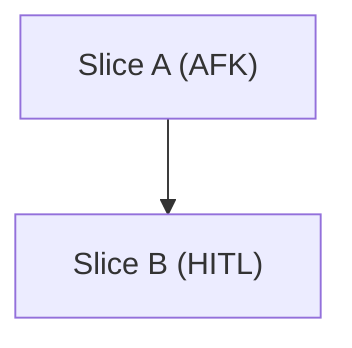

# Slice Templates

## Breakdown Comment

````markdown
## Slice Breakdown

### Dependency Graph



### Slices
- `Slice:` Slice A
  `Type:` AFK
  `Size:` S
  `Blocked by:` none
  `Parallel:` yes
- `Slice:` Slice B
  `Type:` HITL
  `Size:` M
  `Blocked by:` Slice A
  `Parallel:` no

### Coverage
- `FR-1:` Slice A
- `FR-2:` Slice A, Slice B
- `NFR-1:` Slice B
````

## Slice Issue

````markdown
## Parent PRD
- `Issue:` #123
- `Breakdown:` <comment-url>

## Slice Overview
- Thin end-to-end behavior

## Acceptance
- [ ] `AC-1:` [specific behavior]

## Coverage
- `US-1:` [brief]
- `FR-1:` [brief]
- `NFR-1:` [brief]

## Technical Hints
- `path/to/module.ts:` pattern or seam

## Type
- `Type:` AFK

## Blocked By
- `Blocked by:` none

## Size
- `Size:` S
````
